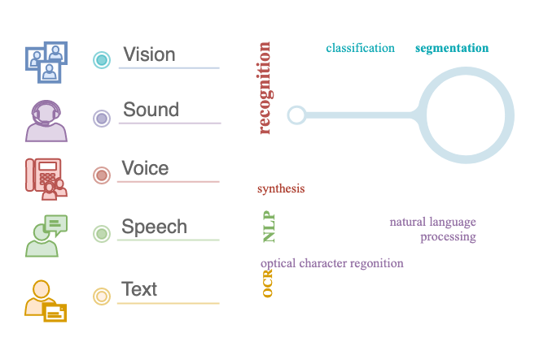
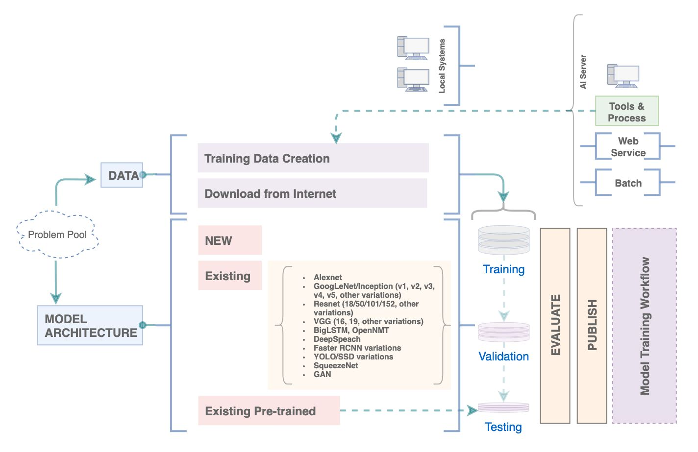
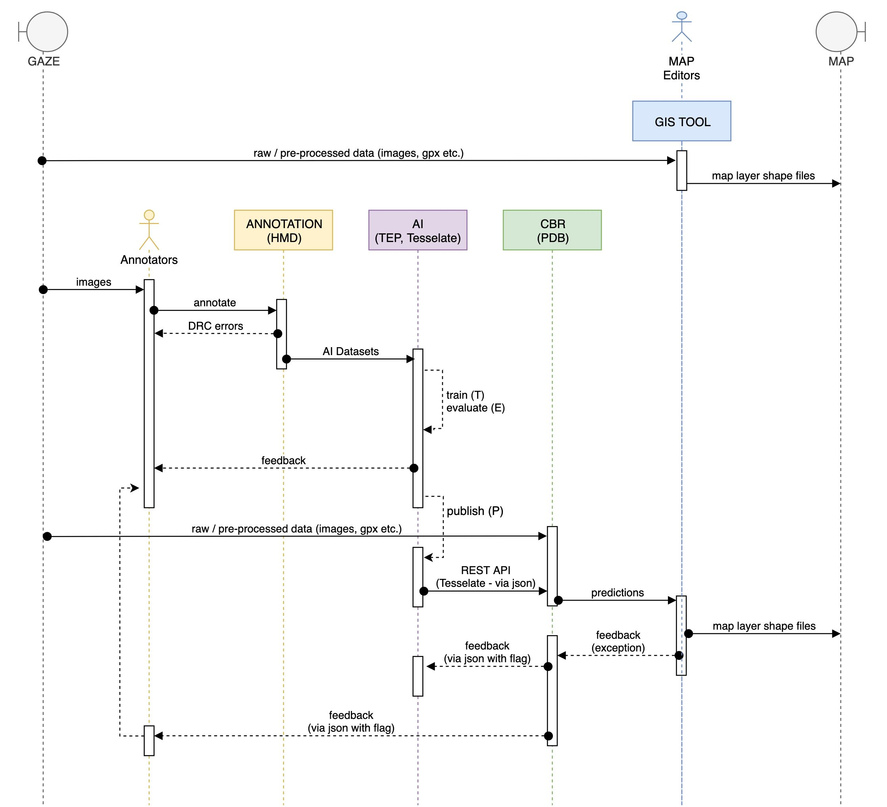
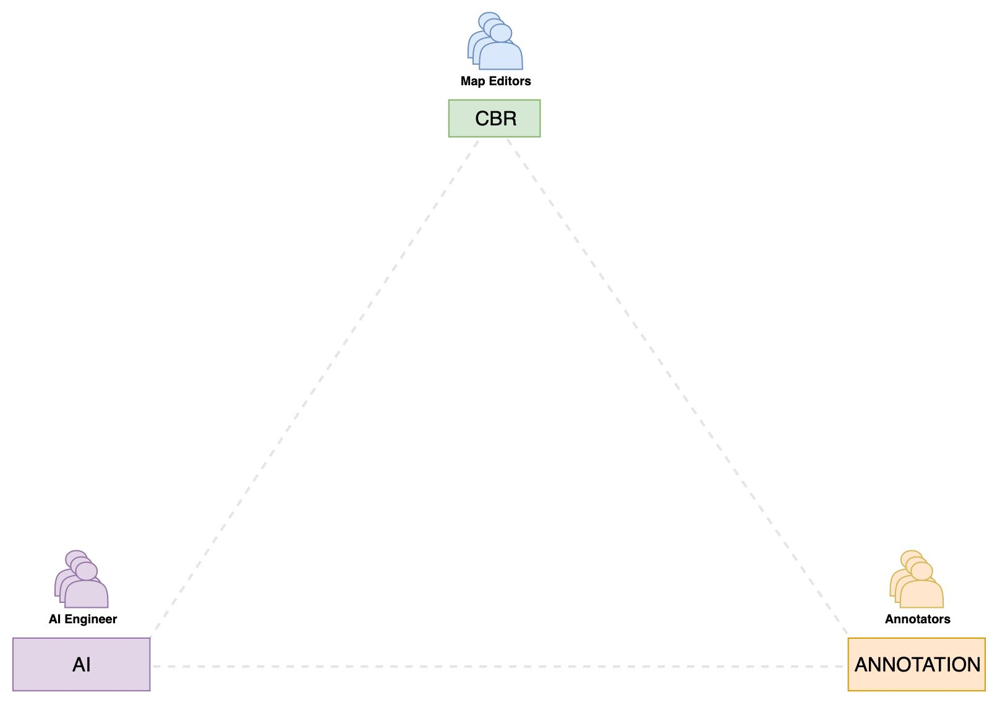
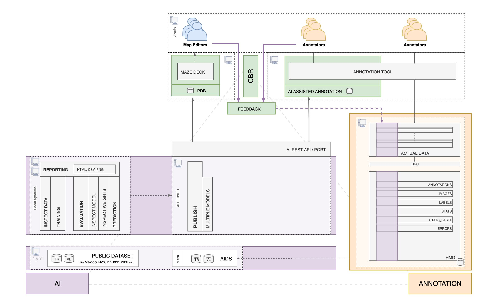
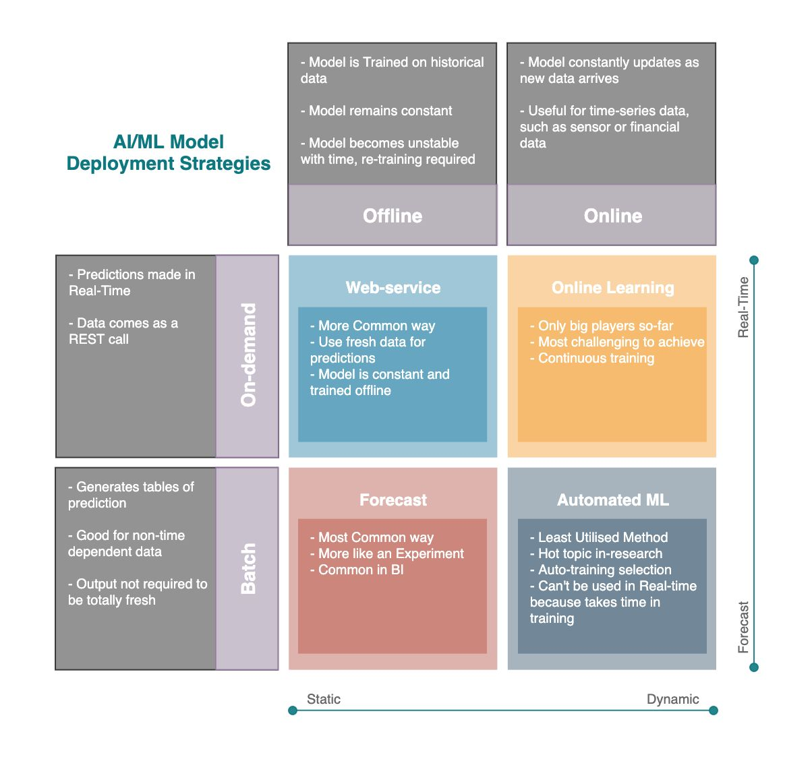
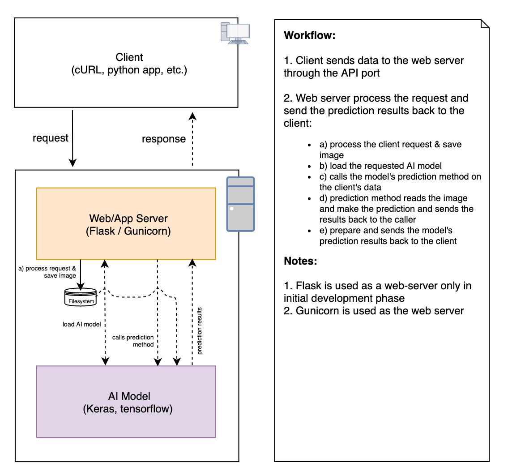

# System Design


## Artitecture and Overview


**AI Problems**




**AI Workflow Setup Overview**



**End-to-end Eventflow**



**Overview 3 Box Model**



**Detailed 3 Box Model - Layered**



**ML/AI Deplyoment Strategies**



**Web API**



## Conventions

* `.sh` scripts are used for creating 1st level of variables, environment variables and generate configurations
* All the environment variables should be prefixed with `AI_`
* yaml file used as `.yml`
* all the configrations in python programs are loaded using `.yml` files
* `paths.yml` and `app.yml` files are 2nd level of configurations files
  * these files are generated by their python counterpart with same names
  * these files should not be manually edited, as they will always be overwritten


## Top Level Directories

1. **code:** `/aimldl-cod` - main repo
2. **data:** `/aimldl-dat` - internal repo
3. **remote mount points:** `/aimldl-mnt`
4. **configuration:** `/aimldl-cfg` - internal repo
  - dataset, DNN archtecture and modelinfo
5. **specifications and documentations:** `/aimldl-doc` - internal repo
6. **reporting:** `/aimldl-rpt` - internal repo
7. **research references:** `/aimldl-kbank` - internal repo


## `/aimldl-cod`: Code Directory Structure

* This repository is code repository mapping to: **`/aimldl-cod`**
  ```bash
  ├── apps
  │   ├── annon
  │   │   ├── images
  │   │   └── samples
  │   ├── falcon
  │   │   ├── arch
  │   │   ├── images
  │   │   ├── log
  │   │   └── utils
  │   ├── pixel
  │   └── www
  │       └── od
  ├── auth
  ├── cfg -> /aimldl-cfg
  ├── dat -> /aimldl-dat
  ├── doc -> /aimldl-doc
  ├── external
  │   ├── batchgenerators
  │   ├── lanenet-lane-detection
  │   ├── lanenet-server
  │   ├── Mask_RCNN
  │   ├── medicaldetectiontoolkit
  │   └── TuSimple-lane-classes
  │
  ├── kbank -> /aimldl-kbank
  ├── mnt -> /aimldl-mnt
  ├── practice
  │   ├── mangal
  │   ├── nikhil
  │   └── saqib
  │
  ├── readme
  ├── rpt -> /aimldl-rpt
  ├── samples
  ├── scripts
  │   ├── annon
  │   ├── api
  │   ├── auth
  │   ├── config
  │   ├── context
  │   ├── docker
  │   │   └── mongo
  │   ├── logs
  │   ├── system
  │   │   └── logs
  │   └── teppr
  ├── _site
  └── tests
      └── images
  ```

### `apps/`

* `annon`
  * Annotation workflow and parser for computer vision tasks
* `falcon`
  * Router interface for different DNNArch
* `www`
  * Web applications
  * contains the web applications providing the interface with the ML programmes
  * should contain individual directory for different applications
  * these should be able to run in the wsgi webserver
  * structure should be:
    - `<appName>/wsgi-bin`
    - this structure gives the flexibility to use the application under standalone python server or as a wsgi module under apache
    - ideally, applications should be developed and used as wsgi apps only for the web deployment


### `external/`: git clones for neural network and related code

* Any external git repos cloned under this directory for experimental purpose or otherwise
* No git clones should exists directly under the root directory
* `git remote -v` commnd can be runned inside the `external/<cloneRepo>` to know its git-hub URL
* It may or may not be a submodule, depending on the maturity of codebase


### `practice/`: practice code on a per-developer basis
* This directory exists to have learning and practice codes.
* Though even during practice its ideal to keep the data separate if possible
* Created as submodules on a per-developer basis
  * `practice/<developer_name>`
  * submodules:
    * `practice/mangal`: https://github.com/mangalbhaskar/snippets


### `tests/`: test cases and scripts

* test cases and testing scripts


### `auth/`: authentical keys, certificates, API keys

* provided as empty director as a placeholder
* in-house or commerical services security/access keys


### `_site/`: documentation webpages

* script generated documentation webpages


### `scripts/`: setup and utility scripts

1. **Directory Setup**
  * Provide convenience scripts for project setup directory structures and execute different apps
  * `setup.sh`
    - create required directory structures
    - one time setup
  * `config.sh`
    - key file provided all the configurations, creating environments variables etc
  * `config.custom.sh`
    - provide custom paths and other configuration options
2. **Docker Setup**
  * Provide convenience scripts for setting up the mongodb docker container
  * `docker.setup.sh`
    - create mongo docker container in a consistent way
  * `docker.env.sh`
    - Docker specific variables, provides mapping of host directories
    - Purposely kept independent of other config file and hence required to keep the values in sync with directory structure created by the setup scripts. Hence, any change in the setup scripts should map to respective paths 
  * `docker.buildimg.sh`
    - Builds the mongodb custom image from the official mongodb image
    - provides a workaround fix for monogodb host user's uid, gid mapping to the container
    - **Refer:** https://github.com/mangalbhaskar/mongo/tree/master/4.1
  * `docker.exec.sh`
    - user mapping to the bash prompt inside the container
3. **Misc**
  * `common.sh`
    - convenience utility script providing common functions and variables
  * `mount.sh`
    - use `sshfs` to mount remote directories locally
    - stup to execute `config.mount.local.sh`
    - create file: `scripts/config.mount.local.sh`, with following content
      ```bash
      remote_user="username"
      remote_ip="<ip>"
      mount_machprefix="<dir-prefix-for-remote-machine>"
      ```
  * **Annon Utility Scripts**
    - `annon_to_db.sh`
    - `test_annon_to_db.sh`
    - `run_batch_annon_to_db.sh`
    - **Refer:** [Annotation Workflow Specification](spec.apps.annon.md)
4. **External Repo**
  * `scripts/setup.external.sh`
  * cloudy_vision, cloudy_vision_web - **Commercial API Implementatino App**
  * VIA VGG Image Annotation
  * semantic-search - CBIR
  * **Specific DNN code repos**
    * py-faster-rcnn
    * Mask_RCNN
    * 3D-R2N2
    * Pixel2Mesh
    * Lanenet


### **Setup Directory Hierarchy**

* **AI_CODE_DIR_PATHS**
  - Development Environment directory structure
  - This is available as a part of git/github clone
    ```bash
    /aimldl-cod/apps
    /aimldl-cod/auth
    /aimldl-cod/external
    /aimldl-cod/practice
    /aimldl-cod/_site
    /aimldl-cod/scripts
    /aimldl-cod/tests
    ```
* **AI_DATA_DIR_PATHS**
  - MongoDB data bindings for local DB
    ```bash
    /aimldl-dat/data-mongodb
    /aimldl-dat/data-mongodb/db
    /aimldl-dat/data-mongodb/logs
    /aimldl-dat/data-mongodb/key
    /aimldl-dat/data-mongodb/configdb
    ```
  - Public datasets
    ```bash
    /aimldl-dat/data-public
    ```
  - Gaze data bindings
    ```bash
    /aimldl-dat/data-gaze
    /aimldl-dat/data-gaze/AIML_Annotation - mount from the remote system as read only
    ```
  - Directories for file based release
    ```bash
    /aimldl-dat/data-gaze/AIML_Database
    /aimldl-dat/data-gaze/AIML_Aids
    /aimldl-dat/data-gaze/AIML_Database_Test - For testing
    /aimldl-dat/data-gaze/AIML_Aids_Test - For testing
    ```
  - TEPPr workflow logs, configurations
    ```bash
    ## All logs
    /aimldl-dat/logs
    ## Test samples
    /aimldl-dat/samples
    ## DNN Model release
    /aimldl-dat/release
    ## Reports
    /aimldl-dat/reports
    ## DNN configurations to be uploaded to DB
    /aimldl-cfg/model
    /aimldl-cfg/arch
    /aimldl-cfg/dataset - deprecated
    ```
* **AI_MOUNT_PATHS_FOR_REMOTE:**
  - remote machines mount points for TEPPr workflow. Change as per system availability
    ```bash
    /aimldl-mnt/vtq-alpha
    /aimldl-mnt/vtq-prime
    /aimldl-mnt/vtq-samba-100
    ```
* **cfg_base_path**: TODO
* **doc_base_path**: TODO
  - Project specific documentation management, specifications etc.
  - Ideally should be mapped to google docs, or remote directories with read and write
    ```bash
    /aimldl-doc
    ```

### MongoDB Docker Container

* Host Directories (created in setup) mapped inside the container
  ```bash
  aimldl-cfg
  aimldl-cod
  aimldl-dat
  aimldl-scripts - accessibility of the the utility scripts inside docker container
  ```
